# Proof of Execution & Engineering Documentation

Welcome! This document serves as a practical showcase of the results and evidence proving the successful execution of the Data Pipeline I built. I took these screenshots while the system was running live to clearly demonstrate the implementation of complex engineering concepts-such as distributed parallel processing via PySpark, preventing data duplication (Idempotency), and ensuring strict data quality.

---

## 1. Code Quality & Intelligent File Routing

### 1.1. Automated Testing Success (Pytest)
I wanted to leave absolutely no room for error, so I wrote 13 automated tests to meticulously verify every single cleaning rule, as well as the quarantine logic and the audit trail generation. As you can see in this screenshot, all tests passed successfully and lit up in green!
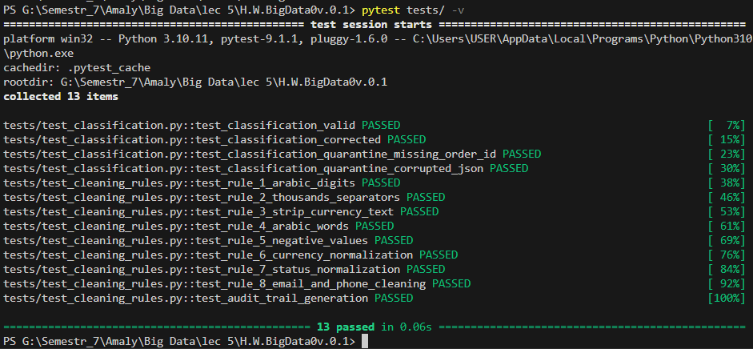

### 1.2. The Smart File Router
One of the features I'm most proud of in this system is its ability to evaluate the file size and automatically select the optimal processing engine. Here, we can see how the system read the sample data size (41.77MB) and immediately decided to use the lightweight `python_batch` engine, completely avoiding the heavy overhead of spinning up Spark for a small file.
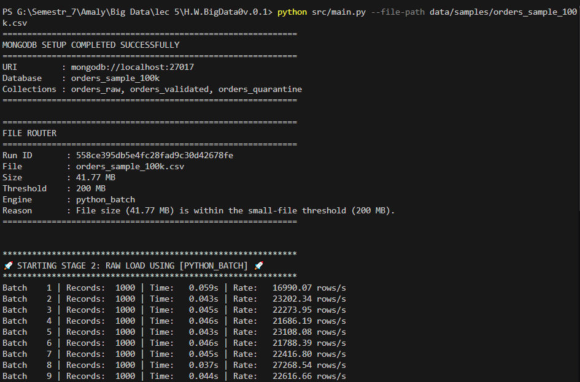

---

## 2. Data Processing & Idempotency Proof

### 2.1. Successful Sample Execution & Consistency
This screenshot captures the final output after the system processed 100,000 records. The beauty here is the `PASSED ✅` badge, which confirms that the system mathematically verified its own work, ensuring that not a single record was lost during the ETL process.
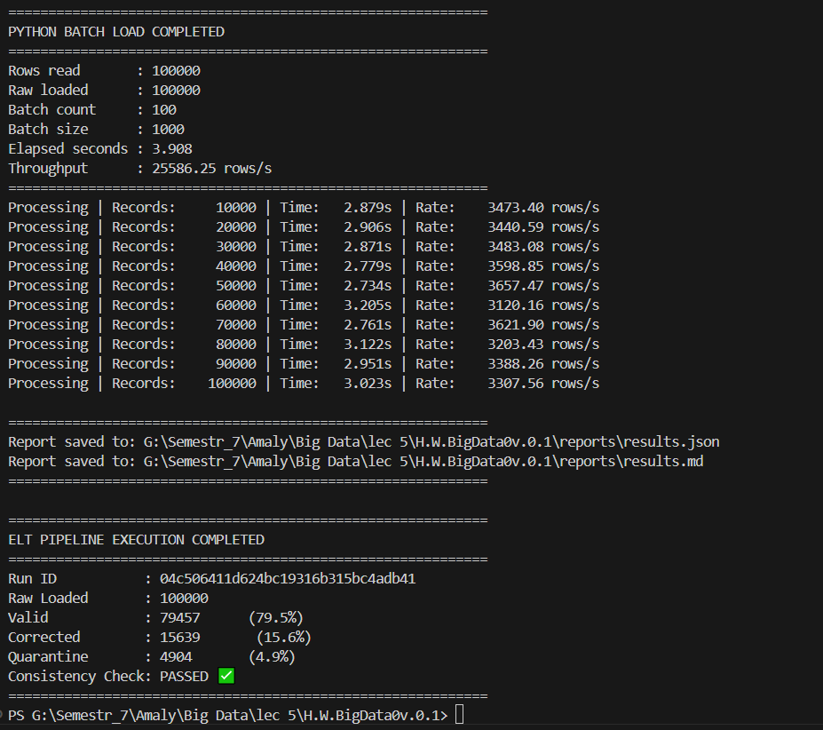

### 2.2. The Golden Proof of Idempotency
To prove that my system is smart and does not blindly duplicate data, I executed the exact same file a second time. As clearly shown in the JSON report, the `"inserted_count"` is exactly zero! The system recognized that the data already existed in the database and handled it gracefully via Upsert.
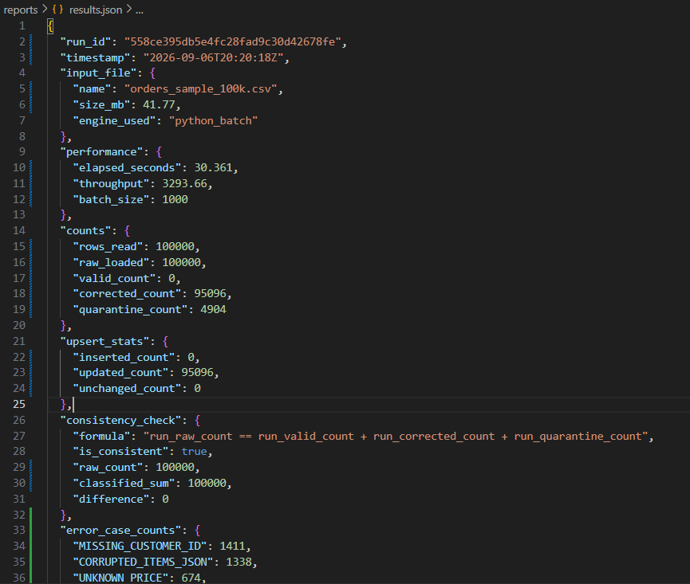

---

## 3. Database Engineering (MongoDB)

### 3.1. Tracking Modifications (Audit Trail)
I didn't just want to clean corrupted data; I wanted to maintain a historical record of exactly what changed. In this database screenshot, you can see the `corrections` array, which accurately logs the transformations applied to the document.
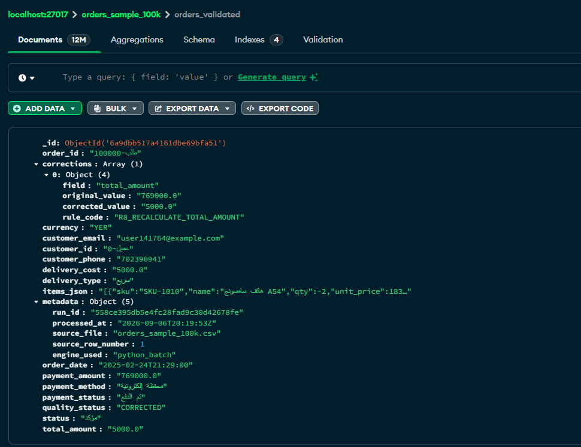

### 3.2. Protecting IDs from Duplication
To guarantee the integrity of the database, I enforced a Unique Index on the `order_id` field. This screenshot proves the existence of the `idx_val_order_id_unique` index, which strictly forbids any future ID collisions.
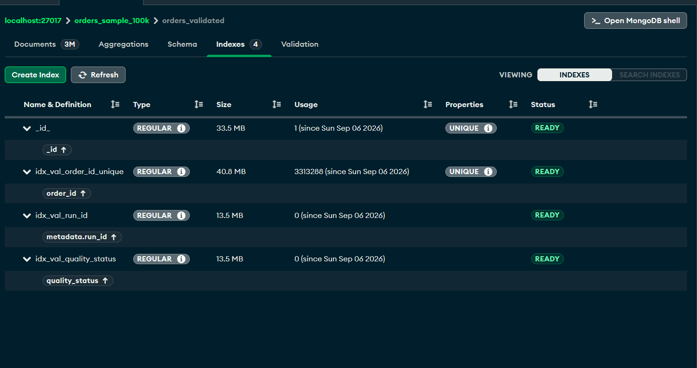

### 3.3. Guarding the Database Structure (Schema Validation)
To ensure that any data entering the target collections complies with our strict standards, I utilized MongoDB's `$jsonSchema`. This shot demonstrates how the database actively rejects any record that is missing mandatory fields or contains out-of-bounds enum values.
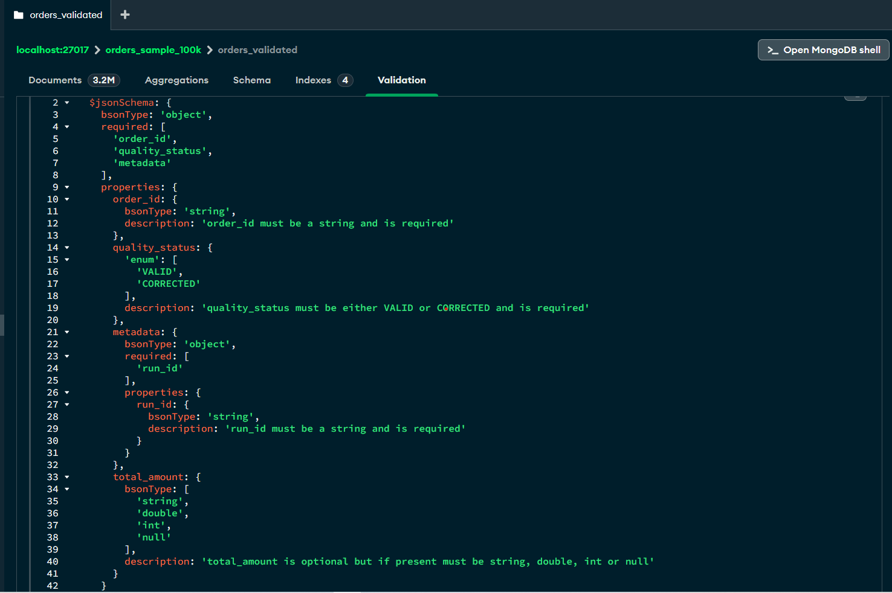

### 3.4. The Quarantine Zone
Here we can see the "hopeless" records that the system couldn't safely repair. They were successfully isolated into the `orders_quarantine` collection, complete with an attached array explaining exactly why they were rejected (`error_codes`), making it extremely easy for data stewards to review them later.
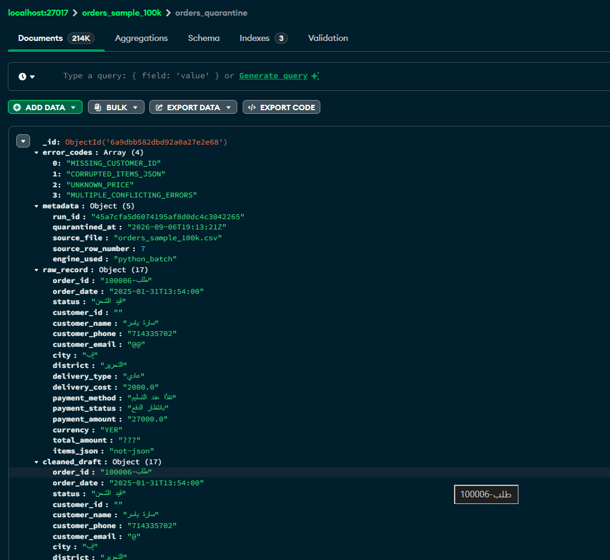

---

## 4. Conquering Big Data (PySpark)

### 4.1. Intelligent Routing for Big Data (PySpark)
This screenshot proves the File Router in action when dealing with massive datasets. Unlike the earlier 41MB sample, the system detected a dataset size exceeding the threshold and intelligently opted to spin up the `pyspark` engine to handle the load effectively.
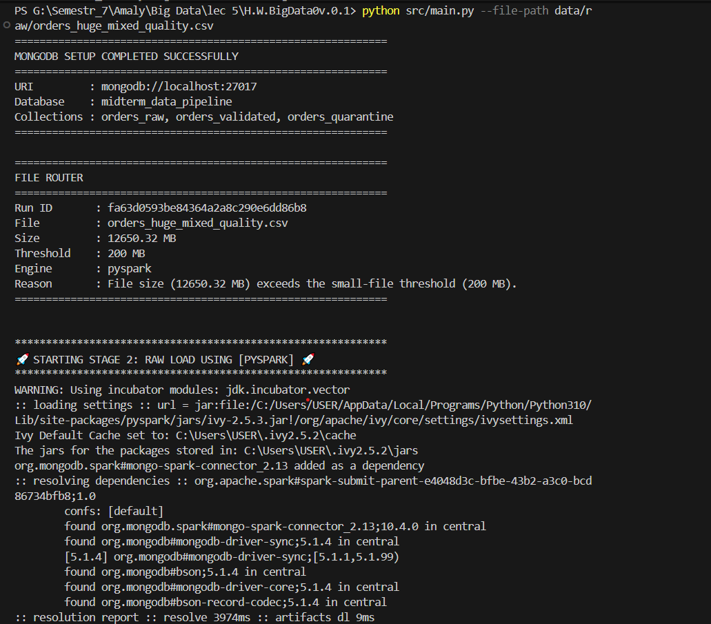

### 4.2. Handling 30 Million Records (PySpark Load)
This screenshot is the crown jewel of the project. Here, I prove that the system successfully handled a massive dataset containing 30 million records (12.65 GB). Powered by the `pyspark` engine, the data throughput reached an incredible speed of over 85,000 records per second!
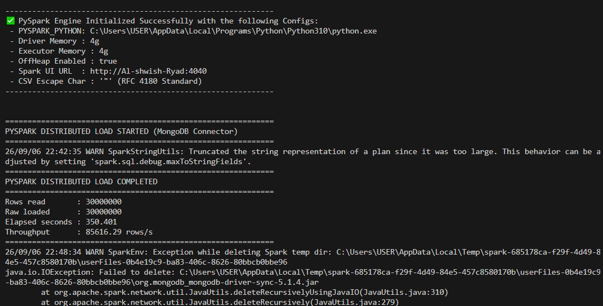

### 4.3. Parallel Task Management Dashboard
To prove that I am utilizing true distributed parallel processing, I documented the official Apache Spark Web UI. The screenshot shows my custom application, `OrdersPipeline`, actively running and efficiently distributing tasks across the executors.
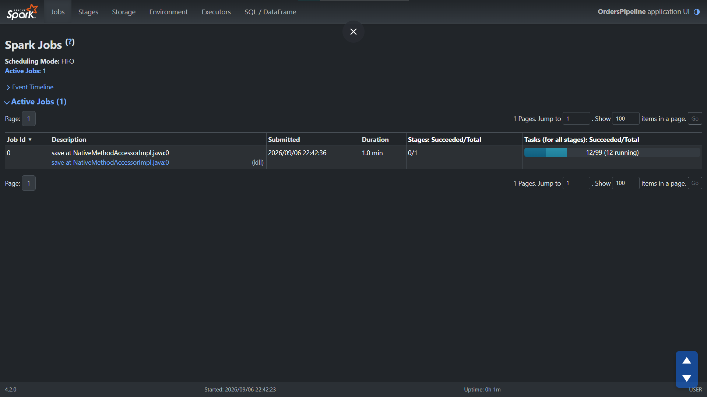

### 4.4. Execution Stage Partitioning
This final screenshot provides a deep dive into how Spark partitioned the massive 6.0 GiB workload into manageable Stages and micro-tasks. It processed them perfectly in parallel across all CPU cores to guarantee maximum execution speed.
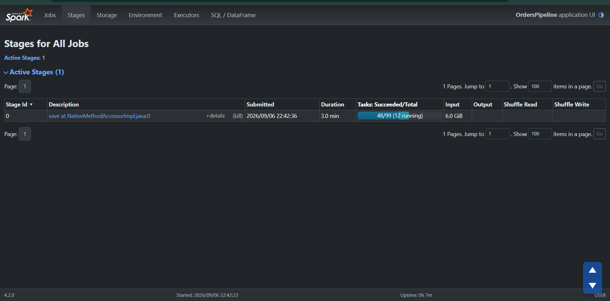
