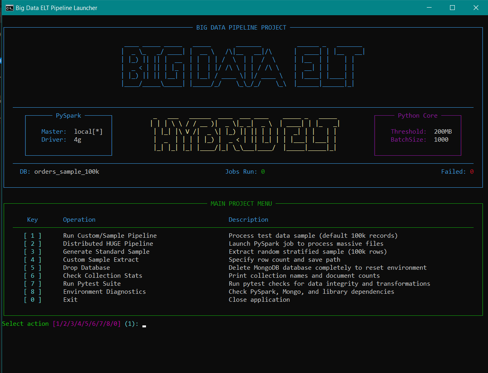
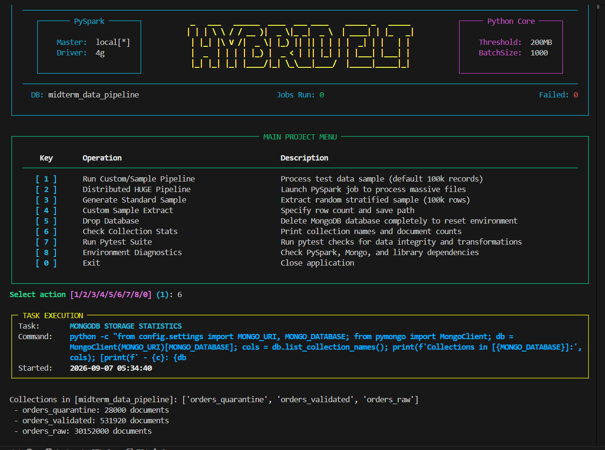
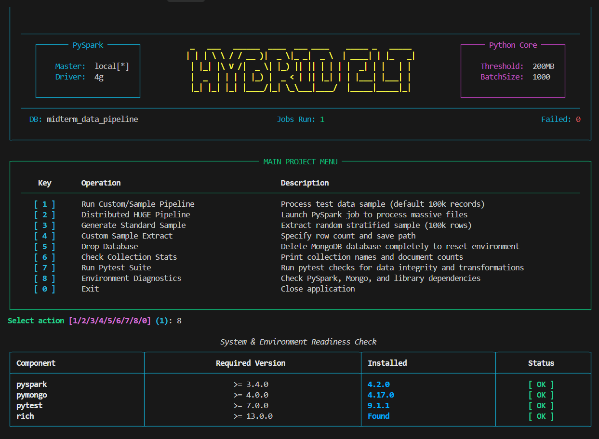

# My Big Data ELT Pipeline: User Guide & Journey 

Welcome to the **User Guide** for my Big Data ELT (Extract, Load, Transform) Pipeline project! 
For this assignment, I wanted to build something beyond a simple script. I aimed to engineer a production-ready, highly interactive system capable of handling everything from small sample datasets to massive 30-million row files effortlessly. 

This document will walk you through how to set up the environment, run the interactive dashboard I designed, and explore the results of the pipeline.

---

## 1. Prerequisites (What you need)
Before running my pipeline, please make sure your local machine is set up with the following:
- **Python:** Version 3.9 or newer.
- **MongoDB:** Running locally on the default port (`mongodb://localhost:27017`).
- **Apache Spark:** Installed and properly configured in your system environment variables.
- **Python Packages:** You can install all my required dependencies by running `pip install -r requirements.txt` (this includes `pymongo`, `pyspark`, and `rich` for the UI).

---

## 2. Where to Put the Data?
I designed the project with a clean folder structure. You just need to drop your CSV files into the `data` directory:
- Massive, gigabyte-sized files belong in: `data/raw/`
- Small testing samples belong in: `data/samples/`

---

## 3. The Interactive Dashboard (How to Run)

Instead of forcing you to type long, complicated terminal commands, I built a **Rich Interactive Control Panel**. It automatically manages the execution, data sampling, database cleaning, and automated testing.

Here is how you can launch it:
1. Make sure your dependencies are installed:
   ```powershell
   pip install -r requirements.txt
   ```
2. Simply double-click the launcher, or run it from your terminal:
   ```powershell
   .\run.bat
   ```

A beautiful, full-screen interactive UI will appear. You simply press a number (e.g., `1` to run a small sample, `2` to execute the massive PySpark pipeline) and hit Enter!

*(Note: If you are a traditionalist, you can still run the pipeline manually using `python src/main.py --file-path ...`, but the dashboard is highly recommended for the best experience).*

### A Tour of the Dashboard:

**1. The Main Dashboard:**
When you launch the script, you are greeted by this organized view displaying my PySpark configurations and current environment thresholds.


**2. Task Execution Panel:**
Whenever you trigger an action, a dedicated panel pops up. It shows you the exact backend command being executed and tracks its progress in real-time.


**3. Environment Diagnostics:**
I added Option 8 as a safety check. It scans the system to ensure PySpark, MongoDB, and all necessary libraries are installed and ready to go.


---

## 4. Resetting the Environment
If you need a clean slate, I've got you covered. By selecting **Option 5 (Drop Database)** in the dashboard, the system safely wipes the MongoDB database defined in `settings.py`. It requires a strict `DROP` confirmation typing to prevent accidental data loss.

---

## 5. Outputs, Reports, and Metrics
Once the pipeline finishes running (which takes seconds for small files, and a bit longer for huge ones depending on your CPU), my system generates multiple layers of feedback:

1. **Terminal Summary:** A quick overview is printed immediately, showing valid, corrected, and quarantined record counts, along with a mathematical `Consistency Check: PASSED ✅`.
2. **Automated Reports:** I programmed the system to output detailed metrics into the `reports/` folder:
   - `results.json`: A deep technical breakdown (execution time, throughput, upsert stats).
   - `results.md`: A clean, readable Markdown version of the metrics.
3. **The Database (MongoDB):** Open up *MongoDB Compass* and connect to `localhost:27017`. You will see three neatly organized collections: `orders_raw`, `orders_validated`, and `orders_quarantine`.

---

## 6. A Note on PySpark Memory Tuning
When dealing with massive data, memory crashes (OOM) are a developer's worst nightmare. To prevent this, I explicitly tuned the PySpark engine in my code:
- **Memory Allocation:** I allocated **4GB** of driver memory (`spark.driver.memory`) to ensure smooth shuffling and aggregation.
- **CSV Parsing Safety:** I implemented strict `escape` characters in the Spark CSV reader to ensure that nested JSON arrays inside the CSV columns are parsed perfectly without breaking the schema.

Thank you for exploring my project! I hope you enjoy using this pipeline as much as I enjoyed building it.
