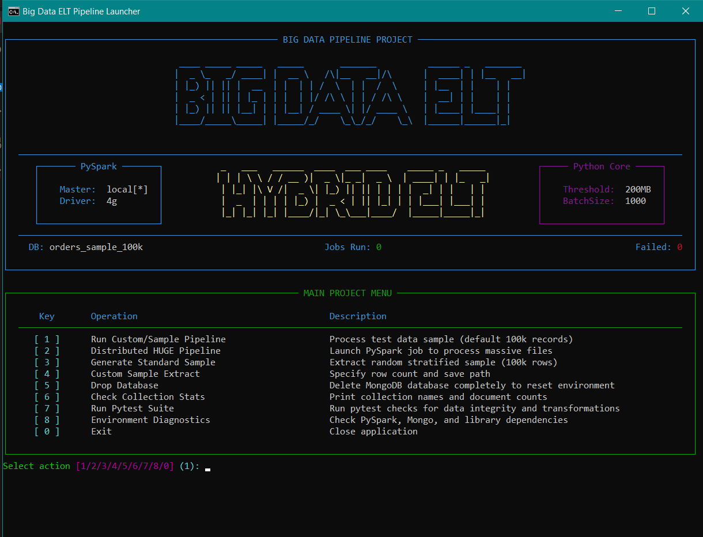
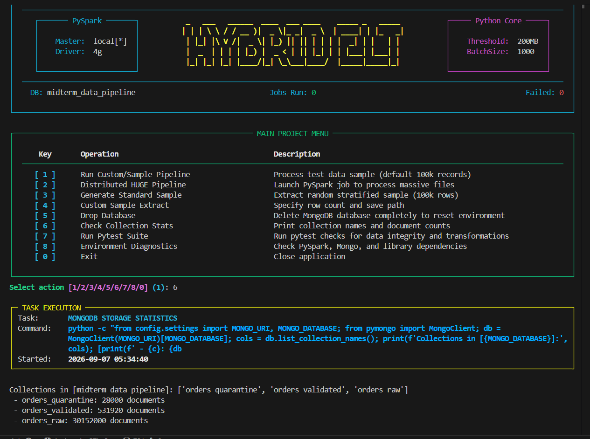
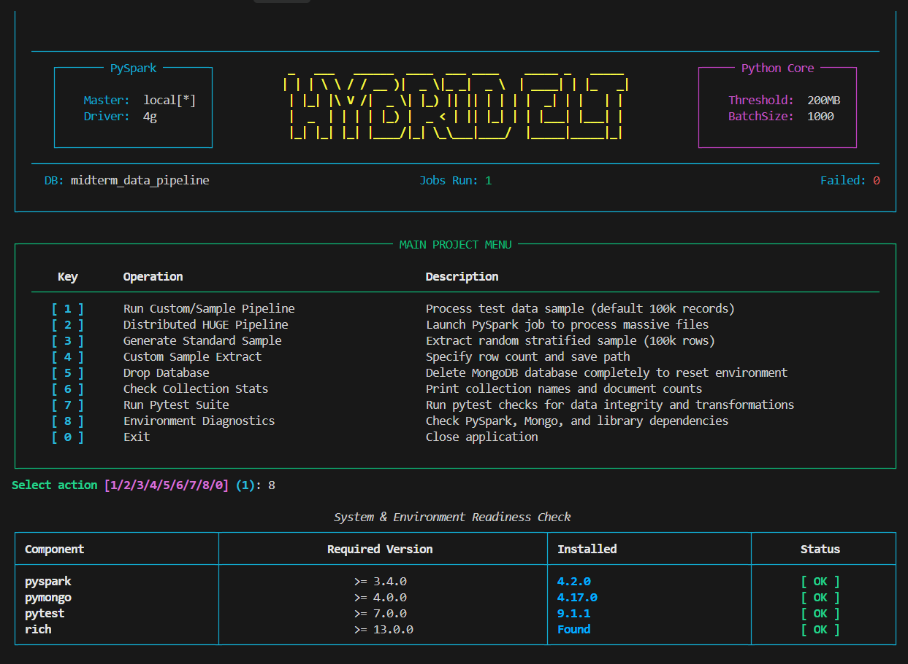

# My Big Data ELT Pipeline: User Guide & Journey 

Welcome to the **User Guide** for my Big Data ELT (Extract, Load, Transform) Pipeline project! 
For this assignment, I wanted to build something beyond a simple script. I aimed to engineer a production-ready, highly interactive system capable of handling everything from small sample datasets to massive 30-million row files effortlessly. 

This document will walk you through how to set up the environment, run the interactive dashboard I designed, and explore the results of the pipeline.

---

## 1. Prerequisites (What you need)
Before running my pipeline, please make sure your local machine is set up with the following:
- **Python:** Version 3.9 or newer.
- **MongoDB:** Running locally on the default port (`mongodb://localhost:27017`).
- **Apache Spark:** Installed and properly configured in your system environment variables.
- **Python Packages:** You can install all my required dependencies by running `pip install -r requirements.txt` (this includes `pymongo`, `pyspark`, and `rich` for the UI).

---

## 2. Where to Put the Data?
I designed the project with a clean folder structure. You just need to drop your CSV files into the `data` directory:
- Massive, gigabyte-sized files belong in: `data/raw/`
- Small testing samples belong in: `data/samples/`

---

## 3. The Interactive Dashboard (How to Run)

Instead of forcing you to type long, complicated terminal commands, I built a **Rich Interactive Control Panel**. It automatically manages the execution, data sampling, database cleaning, and automated testing.

Here is how you can launch it:
1. Make sure your dependencies are installed:
   ```powershell
   pip install -r requirements.txt
   ```
2. Simply double-click the launcher, or run it from your terminal:
   ```powershell
   .\run.bat
   ```

A beautiful, full-screen interactive UI will appear. You simply press a number (e.g., `1` to run a small sample, `2` to execute the massive PySpark pipeline) and hit Enter!

*(Note: If you are a traditionalist, you can still run the pipeline manually using `python src/main.py --file-path ...`, but the dashboard is highly recommended for the best experience).*

### A Tour of the Dashboard:

**1. The Main Dashboard:**
When you launch the script, you are greeted by this organized view displaying my PySpark configurations and current environment thresholds.


**2. Task Execution Panel:**
Whenever you trigger an action, a dedicated panel pops up. It shows you the exact backend command being executed and tracks its progress in real-time.


**3. Environment Diagnostics:**
I added Option 8 as a safety check. It scans the system to ensure PySpark, MongoDB, and all necessary libraries are installed and ready to go.


---

## 4. Resetting the Environment
If you need a clean slate, I've got you covered. By selecting **Option 5 (Drop Database)** in the dashboard, the system safely wipes the MongoDB database defined in `settings.py`. It requires a strict `DROP` confirmation typing to prevent accidental data loss.

---

## 5. Outputs, Reports, and Metrics
Once the pipeline finishes running (which takes seconds for small files, and a bit longer for huge ones depending on your CPU), my system generates multiple layers of feedback:

1. **Terminal Summary:** A quick overview is printed immediately, showing valid, corrected, and quarantined record counts, along with a mathematical `Consistency Check: PASSED ✅`.
2. **Automated Reports:** I programmed the system to output detailed metrics into the `reports/` folder:
   - `results.json`: A deep technical breakdown (execution time, throughput, upsert stats).
   - `results.md`: A clean, readable Markdown version of the metrics.
3. **The Database (MongoDB):** Open up *MongoDB Compass* and connect to `localhost:27017`. You will see three neatly organized collections: `orders_raw`, `orders_validated`, and `orders_quarantine`.

---

## 6. A Note on PySpark Memory Tuning
When dealing with massive data, memory crashes (OOM) are a developer's worst nightmare. To prevent this, I explicitly tuned the PySpark engine in my code:
- **Memory Allocation:** I allocated **4GB** of driver memory (`spark.driver.memory`) to ensure smooth shuffling and aggregation.
- **CSV Parsing Safety:** I implemented strict `escape` characters in the Spark CSV reader to ensure that nested JSON arrays inside the CSV columns are parsed perfectly without breaking the schema.

---

## 7. Phase 2: Running the Evaluation API & Interactive Swagger UI

For the final evaluation phase, the entire platform is accessible via an interactive REST API built with FastAPI and documented via OpenAPI / Swagger UI.

### 7.1. Launching the API Server
Start the Uvicorn ASGI server with live reloading:
```powershell
uvicorn src.api:app --host 127.0.0.1 --port 8000 --reload
```
Once started, you will see the startup banner confirming that the **Background Task Scheduler** has initialized successfully:
```text
INFO:     Started server process
🚀 Background Task Scheduler started successfully.
INFO:     Uvicorn running on http://127.0.0.1:8000 (Press CTRL+C to quit)
```

### 7.2. Accessing Interactive Swagger UI
Open your web browser and go to:
👉 **[http://127.0.0.1:8000/docs](http://127.0.0.1:8000/docs)**

*(Alternatively, standard ReDoc is available at `http://127.0.0.1:8000/redoc`)*

### 7.3. Step-by-Step Evaluation Walkthrough via Swagger UI

#### 1. System & Health Check (`GET /health`)
- Click on **`GET /health`** $\rightarrow$ **Try it out** $\rightarrow$ **Execute**.
- Confirms MongoDB connection status and displays current document counts across all 6 collections (`orders_raw`, `orders_validated`, `orders_quarantine`, `daily_sales_summary`, `top_products_summary`, `job_logs`).

#### 2. Triggering Ingestion (`POST /ingest`)
- Click on **`POST /ingest`** $\rightarrow$ **Try it out** $\rightarrow$ **Execute**.
- Triggers the automated ELT pipeline on the default sample data file, ingesting records, applying the 8 quality rules, and writing metrics.

#### 3. Creating Indexes (`POST /indexes`)
- Click on **`POST /indexes`** $\rightarrow$ **Try it out** $\rightarrow$ **Execute**.
- Idempotently creates the 3 required indexes on `orders_validated`:
  - `idx_val_city_status` (Compound: `city` + `status`)
  - `idx_val_order_date` (`order_date` descending)
  - `idx_val_customer_id` (`customer_id` ascending)

#### 4. Benchmarking Performance (`GET /indexes/explain`)
- Click on **`GET /indexes/explain`** $\rightarrow$ **Try it out** $\rightarrow$ **Execute**.
- Executes `explain("executionStats")` before and after index creation across 3 test queries, returning exact reduction metrics (up to **98.31%** and **100%** document scan reduction).

#### 5. Executing Business Queries (`GET /queries/{name}`)
- Open **`GET /queries/{name}`** $\rightarrow$ **Try it out**.
- Select any query from the dropdown menu (e.g., `orders_by_city_and_status`, `customer_order_history`).
- Optionally specify parameters like `city`, `status`, or `limit`.
- Click **Execute** to view live JSON results.

#### 6. Running Analytical Aggregations (`GET /aggregations/{name}`)
- Open **`GET /aggregations/{name}`** $\rightarrow$ **Try it out**.
- Select any aggregation from the dropdown (e.g., `sales_by_city`, `top_products`, `top_customers`).
- Click **Execute** to inspect live aggregation results computed by MongoDB's aggregation engine.

#### 7. Materialized Views: Incremental Refresh (`POST /refresh-mv`)
- Open **`POST /refresh-mv`** $\rightarrow$ **Try it out**.
- Set `full_refresh` to `false` for smart incremental refresh (only updates newly ingested dates/products based on watermark), or `true` for a complete historical rebuild.
- Click **Execute**.

#### 8. Reading Materialized Views Directly (`GET /views/{name}`)
- Open **`GET /views/{name}`** $\rightarrow$ **Try it out**.
- Select `daily_sales_summary` or `top_products_summary` from the dropdown.
- Click **Execute** to read pre-aggregated summaries instantly.

#### 9. Scheduled Tasks & Audit Logs (`GET /jobs` & `POST /jobs/{name}/run`)
- Open **`GET /jobs`** to view all registered background tasks along with their last scheduled run results from `job_logs`.
- Open **`POST /jobs/{name}/run`**, select a task from the dropdown (e.g., `refresh_materialized_views`), and click **Execute** to trigger it manually on-demand and receive its `log_id`.

---

## 8. Automated Testing & Verification Suites

All test suites are cleanly organized under the [`tests/`](file:///g:/Semestr_7/Amaly/Big%20Data/lec%205/H.W.BigData0v.0.1/tests/) directory:

```powershell
# 1. Test Indexes, Queries & Explain Plan Analysis
python tests/test_indexes_and_queries.py

# 2. Test Aggregations, Materialized Views & Scheduled Tasks
python tests/test_aggregations_and_views.py

# 3. Test Data Quality Rules (Phase 1)
python -m pytest tests/test_cleaning_rules.py -v

# 4. Test Data Classification Logic (Phase 1)
python -m pytest tests/test_classification.py -v

# 5. Run All Automated Tests
pytest tests/ -v
```

Thank you for exploring my project!

